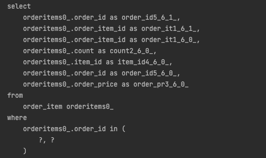

# 페이징과 한계 돌파
[이전](./N+1문제.md)에서 N+1문제를 해결하기 위해 fetch join을 사용했었다.
다음과 같은 코드가 있다고 하자.


```java
@GetMapping("/orders")
public List<OrderDto> orders() {
    List<Order> orders = orderRepository.findAllWithItem();
    return orders.stream()
            .map(OrderDto::new)
            .collect(toList());
}
```

```java
public List<Order> findAllWithItem() {
    return em.createQuery(
            "select distinct o from Order o" + 
            " join fetch o.member m" +
            " join fetch o.delivery d" + 
            " join fetch o.orderItems oi" +
            " join fetch oi.item i", Order.class)
        .getResultList();
}
```

N+1문제를 해결하기 위해 fetch join을 사용해 SQL 쿼리가 한 번만 실행되게 하였다. `findAllWithItem()`메서드를 보면 `distinct`를 사용한 것을 볼 수 있다. 이는 일대다 조인이 있기 때문에 중복이 발생하기 때문에 추가하였다. 이는 페이징이 불가능하다는 단점이 있었는데, 이를 해결해보자.

- 컬렉션을 사용하면 페이징이 불가능하다.
    - 컬렉션을 페치 조인하게 되면 데이터가 예측할 수 없이 증가한다.
    - 일대다 매핑에서 페이징할 때 일(1)을 기준으로 페이징하는 것이 목적인데, 데이터는 다(N)을 기준으로 행이 생성되기 되어버린다. (위에서는 Order를 기준으로 페이징하고 싶은데, OrderItems가 기준이 되어버린다.)

- 페이징 + 컬렉션 엔티티를 함께 조회하는 방법
    1. 먼저 xToOne(@OneToOne, @ManyToOne)관계를 모두 페치 조인한다.(xToOne 관계는 행 수를 증가시키지 않기 때문에 페이징 쿼리에 영향을 주지 않음)
    2. 컬렉션을 지연 로딩으로 조회
    3. 지연 로딩 성능 최적화를 위해 `hibernate.default_batch_fetch_size`, `@BatchSize`를 적용한다.
        - 이 옵션을 사용하면 컬렉션이나 프록시 객체를 한꺼번에 설정한 size만큼 IN 쿼리로 조회해 버린다.



다음과 같이 in쿼리가 나가는 것을 확인할 수 있다.

부모 엔티티의 key하나하나를 자식 엔티티를 조회할 때 사용하는 것이 아닌, 1개씩 사용되는 조건문을 IN절로 묶어서 조회하는 것이다.

## 참고 자료
[인프런-스프링부트와 JPA활용2(김영한)](https://www.inflearn.com/course/%EC%8A%A4%ED%94%84%EB%A7%81%EB%B6%80%ED%8A%B8-JPA-API%EA%B0%9C%EB%B0%9C-%EC%84%B1%EB%8A%A5%EC%B5%9C%EC%A0%81%ED%99%94/dashboard)