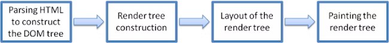
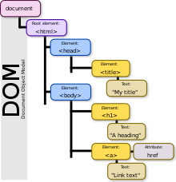

# 리액트, Virtual DOM

리액트의 주요 특징 중 하나는 `Virtual DOM`을 사용하고 있다는 것이다. 

## DOM
`Virtual DOM`을 알기전 `DOM`에 대해 알아야 한다. `DOM`(Document Object Model)은 HTML/XML 문서에 접근하기 위한 인터페이스이다. 즉, 객체로 문서 구조를 표현하는 방법으로 XML이나 HTML로 작성한다.

### 브라우저의 동작원리
`DOM`을 이해하기 위해 브라우저의 동작원리를 알면 좋은데, 브라우저에서 웹 페이지가 어떻게 만들어지는지 알아보자. 
1. 브라우저의 렌더링 엔진은 HTML 파일을 읽어 파싱을 한 후 DOM Tree라 불리는 DOM 노드들를 생성한다.
    - 이때 각 노드들은 HTML 엘리먼트와 연관되어 있다.
2. 이후 렌디링 엔진은 스타일 데이터와 외부 CSS 파일을 읽어 파싱을 진행하고, 스타일 정보를 사용해서 DOM Tree에 따라 새로운 트리인 `Render Tree`를 생성한다.
3. `Render Tree`를 생성한 후 `레이아웃(Layout)`과정을 거친다. 이 과정은 화면에 각 노드들을 배치하는 작업이다.
4. 다음으로 `페인팅(Painting)`작업을 수행하는데, 트리의 각 노드들을 거쳐가며 paint() 메서드를 호출하게 된다.

다시 `DOM`으로 돌아와서 웹 브라우저는 `DOM`을 활용해서 객체에 자바스크립트와 CSS를 적용한다. DOM은 트리 형태이기 때문에 특정 노드를 찾거나 수정, 제거, 삽입을 수행할 수 있다.

이런 `DOM`은 동적 UI에 최적화되어 있지 않다는 문제가 있다. HTML문서 자체는 정적이고, 자바스크립트를 통해서 이를 동적으로 만드는 것이다. 만약 `DOM`에 변화가 생기게 되면 `Render Tree` 전체를 재생성하고 레이아웃을 만들고 페인팅하는 과정을 전부 수행해야 한다. 
하지만 요즘 많은 애플리케이션을 보면 많은 데이터가 로딩되는 것을 확인할 수 있다. 여기서 각 데이터를 포함하는 엘리먼트들이 많을 때 `DOM`을 직접 조작하는 경우 이 변화를 적용하기 위해서 위의 연산을 반복적으로 수행해야 하고 시간이 허비 된다.

이때 `Virtual DOM`을 사용하게 되는데 리액트는 `Virtual DOM` 방식을 사용해 `DOM` 업데이트를 추상화한다. 만약 뷰에 변화가 생긴다면 `DOM`에 실제 적용되기전 `Virtual DOM`에 적용시키고 최종 결과만 실제 `DOM`으로 전달하게 된다.

## Virtual DOM
`Virtual DOM`을 사용하면 실제 `DOM`에 접근해서 조작하는 것이 아니라, 이를 추상화한 자바스크립트 객체를 구성해서 사용한다.

리액트에서 데이터가 변하여 웹 브라우저에 실제 `DOM`을 업데이트 할 때는 다음 세 가지 절차를 밟는다.

1. 데이터를 업데이트하며 전체 UI를 `Virtual DOM`에 리렌더링한다.
2. 이전 `Virtual DOM`에 있던 내용과 현재 내용을 비교한다.
3. 바뀐 부분만 실제 `DOM`에 적용한다.

이렇게 데이터가 바뀔 때마다 실제 `DOM`에 조작을 가하는 대신, `Virtual DOM`에 변화된 부분을 그려버리고 기존에 있던 내용과 비교를 해서 변경된 부분만 `DOM`에 한 번만 보내는 과정을 거친다. 이렇게 하면 렌더링을 한 번만 수행하기 때문에 뷰에 변화가 많을 경우 `Virtual DOM`은 효율을 낼 수 있다. 

## 오해
그런데 `Virtual DOM`을 사용한다고 해서 무조건 빠른 것은 아니다. 변화가 적은 곳에서 적용을 하면 당연히 `DOM`을 직접 조작하는 것보다 느리다. 왜냐하면 `Virtual DOM`이라는 것을 한 번 더 거쳐서 실제 `DOM`에 도달하기 때문이다.

결국 리액트와 `Virtual DOM`이 제공하는 것은 바로 업데이트 처리 간결성이다.

## 참고자료
[DOM 소개](https://developer.mozilla.org/ko/docs/Web/API/Document_Object_Model/Introduction)

[브라우저 작동 방식](https://web.dev/howbrowserswork/)

[리액트를 다루는 기술](http://www.yes24.com/Product/Goods/78233628)