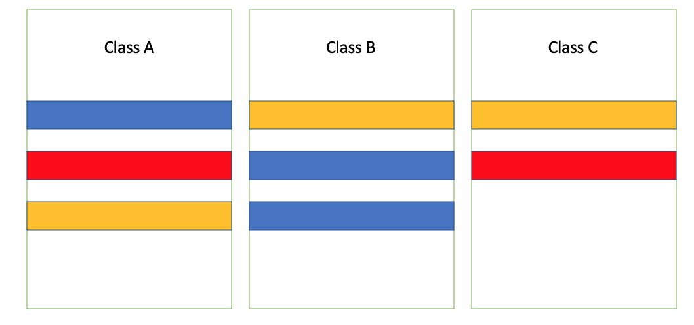
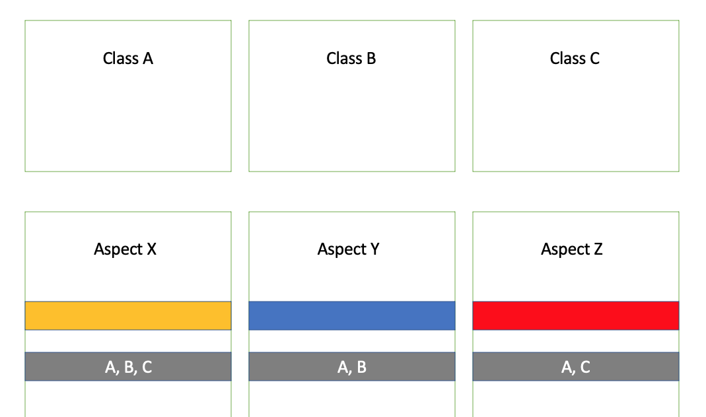

# AoP
AoP(Aspect-oriented Programming) OOP를 보완하는 수단으로, 흩어진 Aspect들을 모아 모듈화 시키는 프로그래밍 기법이다. Aspect란 부가기능 모듈이고, 단어의 의미 그대로 애플리케이션을 구성하는 한 가지 측면이라고 생각할 수 있다. 

## 흩어진 관심사 (Crosscutting Concerns)
다음과 같이 A, B, C 클래스가 있다고 가정하고
클래스별로 가지고 있는 사각형은 기능, 비슷한 코드들(concern: ex. Transaction)이라고 생각하자.

AoP를 적용하기 전에는 다음과 같은 클래스들에 여러 기능들이 나누어져 있었다. 이 기능을 수정하려면 모든 클래스별로 수정해야하는 비용과 시간이 필요했다. 그래서 이를 각 concern별로 Aspect를 모아 다음과 같이 분리했다.

이렇게 독립되게 aspect로 분리한 덕에 핵심기능은 순수하게 그 기능을 코드로만 존재하고 독립적으로 살펴볼 수 있도록 구분된 곳에 존재하게 된것이다.

## AoP의 주요개념
- Aspect와 Target
    - Aspect : OOP의 클래스와 마찬가지로 AoP의 기본모듈이다.
    - Target : 부가기능을 부여할 대상이다.
- Advice
    - Advice : 타깃에게 제공할 부가기능을 담은 모듈이다.
- Join point와 Pointcut
    - Join point : 어드바이스가 적용될 수 있는 위치를 말한다.
    - Pointcut : 어드바이스를 적용할 조인 포인트를 선별하는 작업 또는 그 기능을 정의할 모듈을 말한다.

## AoP구현체
- AspectJ
- 스프링 AoP

## AoP 적용 방법
- 컴파일
- 로드타임
- **런타임**
    - 스프링 AoP를 사용하는 것이다. A라는 빈에다가 Asepct가 가진 메서드를 적용해야하는 것을 스프링이 미리 알고 있는 것이다. A의 빈을 만들 때 A타입의 프록시 빈을 생성해 프록시를 한 번 거치고 A의 빈을 생성하는 것이라고 생각할 수 있다.

## 참고자료
[스프링 프레임워크 핵심 기술](https://www.inflearn.com/course/spring-framework_core/dashboard)
