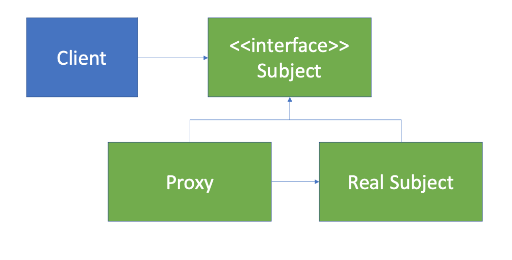

# AOP
스프링에서 제공하는 AOP는 모든 AOP기능을 제공하는 것이 목적이 아니라, 스프링 IoC와 연동하여 엔터프라이즈 애플리케이션에서 가장 흔한 문제에 대한 해결책을 제공하는 것이 목적이다.

## 프록시 패턴
프록시 패턴은 타깃의 기능 자체에는 관여하지 않으면서 접근하는 방법을 제어하거나 부가기능을 추가해주는 프록시를 이용하는 것이다. 

프록시 패턴을 따르는 다음과 같은 구조가 있을 때 코드를 예로 들어보자.

```java
// Subject
public interface EventService {

    void createEvent();

    void publishEvent();

    void deleteEvent();
    
}
```
```java
// RealSubject
@Component
public class SimpleEventService implements EventService {
    @Override
    public void createEvent() {
        try {
            Thread.sleep(1000);
        } catch (InterruptedException e) {
            e.printStackTrace();
        }
        System.out.println("Created on event");
    }
    
    @Override
    public void publishEvent() {
        try {
            Thread.sleep(2000);
        } catch (InterruptedException e) {
            e.printStackTrace();
        }
    }

    @Override
    public void deleteEvent() {
        System.out.println("Delete an event");
    }
}
```
다음과 같이 Subject를 구현하고 있는 SimpleEventService, RealSubject가 있다고 하자. 그런데, 여기서 우리가 시스템의 성능을 측정하기 위해서 다음과 같은 코드를 추가했다.
```java
// RealSubject
@Component
public class SimpleEventService implements EventService {
    
    @Override
    public void createEvent() {
        long begin = System.currentTimeMillis();
        try {
            Thread.sleep(1000);
        } catch (InterruptedException e) {
            e.printStackTrace();
        }
        System.out.println("Created an event");
        System.out.println(System.currentTimeMillis()-begin);
    }
    
    @Override
    public void publishEvent() {
        long begin = System.currentTimeMillis();
        try {
            Thread.sleep(2000);
        } catch (InterruptedException e) {
            e.printStackTrace();
        }
        System.out.println("Published an event");
        System.out.println(System.currentTimeMillis()-begin);
    }

    @Override
    public void deleteEvent() {
        System.out.println("Delete an event");
    }
}
```
프록시를 통해 RealSubject의 코드를 수정하지 않고 성능검증 기능을 추가해보자.
```java
@Component
@Primary
public class ProxySimpleEventService implements EventService {

    @Autowired
    SimpleEventService simpleEventService;

    @Override
    public void createEvent() {
        long begin = System.currentTimeMillis();
        simpleEventService.createEvent();
        System.out.println(System.currentTimeMillis()-begin);
    }

    @Override
    public void publishEvent() {
        long begin = System.currentTimeMillis();
        simpleEventService.publishEvent();
        System.out.println(System.currentTimeMillis()-begin);
    }

    @Override
    public void deleteEvent() {
        simpleEventService.deleteEvent();
    }
}
```
프록시가 RealSubject를 가지고 있으면서 모두 위임하는 구조이다. 하지만 이런 프록시 패턴을 적용한 구조도 문제점을 가지고 있다.
- 매번 프록시 클래스를 작성해야한다.
- 여전히 코드의 중복 문제가 발생한다.
- 여러 클래스, 여러 메서드에 적용하려면 모든 서비스마다 프록시를 생성해 중복된 코드를 심어야한다.

그래서 실행시간에 동적으로 프록시를 생성해주는 스프링 AOP기능을 이용한다.
- 스프링 IoC컨테이너가 제공하는 기반 시설과 Dynamic프록시를 사용하여 여러 복잡한 문제를 해결한다.
- 동적 프록시: 동적으로 프록시 객체를 생성하는 방법이다.
    - 자바가 제공하는 방법은 인터페이스 기반 프록시 생성
    - CGlib를 이용해 클래스 기반 프록시 생성할 수 있다.
- 스프링 IoC: 기존 빈을 대체하는 동적 프록시 빈을 만들어 등록 시켜준다.
    - ```AbstractAutoProxyCreator implements BeanPostProcessor```
    - SimpleEventService를 감싸는 프록시 빈을 생성해 SimpleEventService빈 대신에 프록시 빈으로 등록을 해준다.

## 스프링 AOP
애노테이션 기반의 스프링 @AOP이다.
ProxySimpleEventService 프록시를 삭제하고, 스프링AOP를 사용하기 위해 dependency를 추가하자.
```xml
<dependency>
    <groupId>org.springframework.boot</groupId>       
    <artifactId>spring-boot-starter-aop</artifactId>
</dependency>
```
그리고 Aspect를 적용시킬 메서드를 알려주기위해 ```@PerfLoging```이라는 어노테이션을 생성한다.
```java
@Target(ElementType.METHOD)
@Retention(RetentionPolicy.CLASS)
public @interface PerfLoging { }
```
이후 Aspect를 정의하는 클래스를 만들어주고 이를 빈으로 등록한다.
해야할 일과(Advice) 어디에 적용할 것인지(pointcut)에 대해 작성한다.
```java
@Component
@Aspect
public class PerfAspect {

    @Around("@annotation(PerfLoging)")
    public Object logPerf(ProceedingJoinPoint pjp) throws Throwable {
        long begin = System.currentTimeMillis();
        Object retVal = pjp.proceed();
        System.out.println(System.currentTimeMillis() - begin);
        return retVal;
    }
}
```
pjp는 어드바이스가 적용이 되는 대상이다.(createEvent, publishEvent) pjp.proceed()로 메서드를 실행하고 걸린시간을 출력해준다. 이후 ```@Around```을 통해 어느 곳에 적용할지 명시해준다.

그리고 이 기능을 적용하고자 하는 곳에 ```@PerfLoging```어노테이션을 달아주어 결과를 확인한다.
```
Created an event
1033
Published an event
2004
Delete an event
```
다음과 같이 정상적으로 결과가 출력됨을 확인할 수 있었다.

## 참고자료
[스프링 프레임워크 핵심 기술](https://www.inflearn.com/course/spring-framework_core/dashboard)