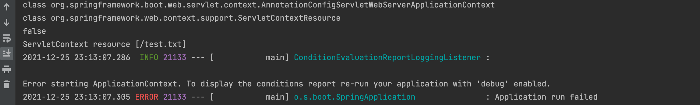

# 리소스 추상화
java.net.URL을 추상화 한 것이다. (리소스 자체를 추상화)
이 java.net.URL을 core.io.Resource 클래스로 감싸서 실제 로우레벨에 있는 리소스에 접근하는 기능을 만든 것이다. 

## 추상화 이유
추상화를 하는 이유는 java.net.URL에는 클래스패스를 기준으로 리소스를 가져오는 기능이 없기 때문이다. java.net.URL은 여러가지 프로토콜(http, https, ftp)을 지원하지만, 스프링 입장에서는 클래스패스를 가져오는 기능도 동일하게 리소스를 가져오는 것이다. 하지만 이를 가져오려면 resourceLoader.getResource를 통해 가져왔었다. 

하나의 인터페이스로 리소스를 가져오는 방법을 통일한 것이고, 이런 리소스를 지칭하는 것을 Resource로 통일한 것이다.

## Resource
원래 xml파일을 통해 다음과 같이 ApplicationContext를 가져왔었다. 
```java
var context = new ClassPathXmlApplicationContext("xxx.xml");
```
여기서 'xxx.xml'이라는 문자열이 내부적으로 Resource로 변환이 된다. 

이것 말고도 파일시스템 경로 기준으로 문자열에 해당하는 리소스를 찾아서 빈 설정파일로 설정하는 방법이 있다.
```java
var context = new FileSystemXmlApplicationContext("xxx.xml");
```

이 Resource 인터페이스의 구현체로는
- UrlResource : 
- ClassPathResource
- FileSystemResource
- ServletContextResource : 웹 애플리케이션 루트에서 상대 경로로 리소스를 찾는다.

등이 있다. 

ServletContextResource를 가장 많이 사용하는데, 읽어들이는 리소스 타입이 ApplicationContext에 따라 결정이 되기 때문이다.
위에서 ApplicationContext가 FileSystemXmlApplicationContext 이면 들어오는 문자열은 FileSystemResource로 리소스타입이 정해진다.

전의 ResourceLoader에서도 getResource의 문자열에 "test.txt" 를 줘도 이 리소스는 classpath를 기준으로 읽어온다는 것이다.

그런데 이런 ApplicationContext의 타입에 상관없이 리소스를 읽을 수 있는데, java.net.URL 접두어를 사용하는 것이다.
- classpath:me/jeongyong/config.xml
- file:///some/resource/path/config.xml

## 코드
```java
@Component
public class AppRunner implements ApplicationRunner {

    @Autowired
    ApplicationContext resourceLoader;

    @Override
    public void run(ApplicationArguments args) throws Exception {
        System.out.println(resourceLoader.getClass());

        Resource resource = resourceLoader.getResource("classpath:test.txt");
        System.out.println(resource.getClass());

        System.out.println(resource.exists());
        System.out.println(resource.getDescription());
        System.out.println(Files.readString(Path.of(resource.getURI())));
    }
}
```
[ResourceLoader](./ResourceLoader.md)에서 사용했던 코드에서 ApplicationContext의 타입과 classpath 접두어를 사용해 가져온 Resource의 타입을 출력해본다.

그러면 각각
- class org.springframework.boot.web.servlet.context.AnnotationConfigServletWebServerApplicationContext
- class org.springframework.core.io.ClassPathResource

가 찍히는 것을 확인할 수 있다. 원래는 기본적으로 ServletApplicationContext가 나와야 하지만 classpath 접두어를 사용했기 때문에 ClassPathResource가 나온 것을 확인할 수 있다.

그러면 여기에서 classpath:test.txt 가 아닌 그냥 test.txt를 사용하면 어떻게 될까?

WebApplicationContext 이기 때문에 기본적으로 ServletContextResource가 될 것이다. 그리고 ServletContextResource는 WebApplication 루트 즉, Context 루트부터 찾게된다. 그런데 스프링부트가 띄워주는 내장형 Tomcat에는 contextpath가 지정되어 있지 않아 exists()는 false가 출력이되고 파일을 읽으려 시도하면 에러가 발생할 것이다.

다음은 출력결과이다.



## 참고자료
[스프링 프레임워크 핵심 기술](https://www.inflearn.com/course/spring-framework_core/dashboard)