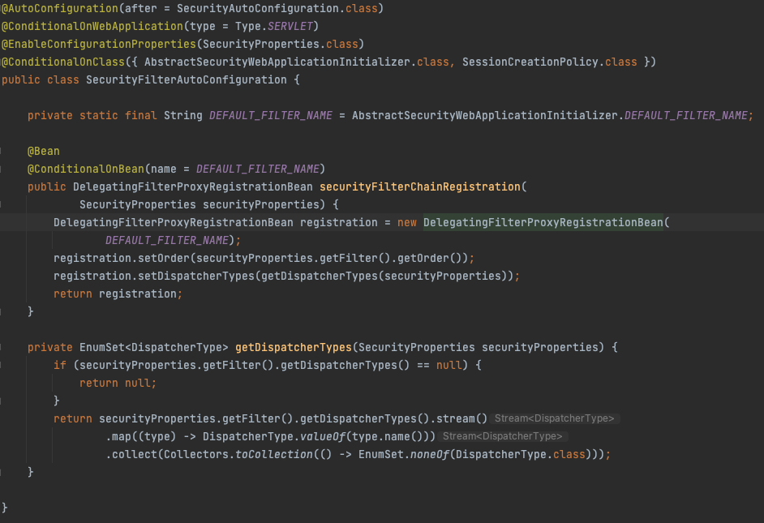
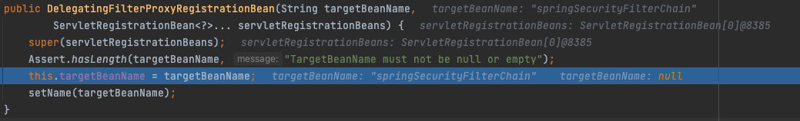
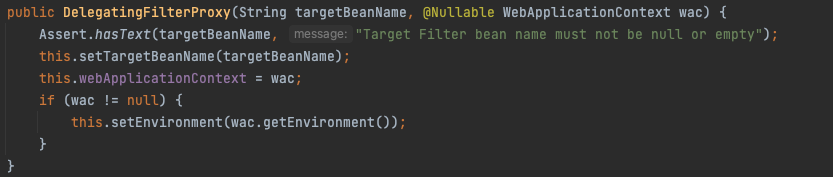
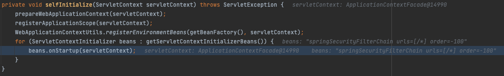
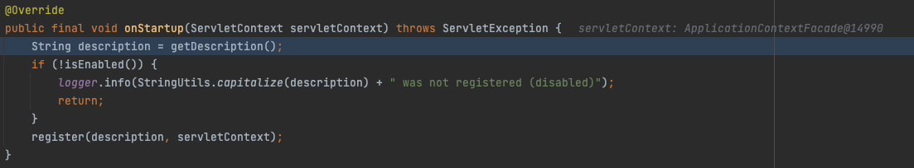
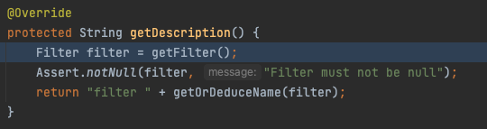

# DelegatingFilterProxy

스프링은 `Filter` 인터페이스 구현체인 `DelegatingFilterProxy`를 제공해준다.  
이 `DelegatingFilterProxy`는 스프링 컨테이너와 서블릿 컨테이너의 라이프 사이클과의 다리 역할을 해준다. 

이는 두 컨테이너가 다르기 때문인데, 서블릿 컨테이너의 필터들은 스프링에서 정의된 빈을 알지 못한다. (빈을 주입 받지 못한다.)  
`DelegatingFilterProxy`는 서블릿 컨테이너의 필터 체인에 등록되어 사용될 수 있으나 모든 요청을 `Filter` 인터페이스를 구현하고 있는 빈들에게 위임한다.

위 그림은 `DelegatingFilterProxy`가 서블릿 필터체인 사이에 등록되어 있는 그림이다. 
위 그림처럼 `DelegatingFilterProxy`는 클라이언트로부터 오는 request를 받아 스프링 컨테이너에 등록되어 있는 `Filter` 인터페이스를 구현한 빈에게 처리를 위임해준다.

그러면 이 `DelegatingFilterProxy`는 어디서 생성되는 것인지 알아보자.

`SecurityFilterAutoConfiguration`에서 `DelgatingFilterProxyRegistrationBean` 빈을 등록해준다.

그러면 `DelgatingFilterProxyRegistrationBean`에서 targetBeanName을 springSecurityFilterChain으로 등록시켜주는데, `FilterChainProxy`의 이름이다. (일단 알아만 놓자.)

이후 `DelgatingFilterProxyRegistrationBean`의 `getFilter` 메서드가 실행이 되면서 `DelegatingFilterProxy`가 생성된다. 이 `getFilter` 메서드는 `AbstractFilterRegistrationBean` 추상 메서드이고, `AbstractFilterRegistrationBean`는 `ServletContextIntializer` 인터페이스를 구현하고 있다.

이는 서블릿 컨테이너에 `DelgatingFilterProxyRegistrationBean`의 getFilter 메서드가 만들어낸 필터를 등록하게 된다.

콜 스택을 그대로 따라가보면, 

ServletIntializer의 onStartup 메서드가 호출되고,

RegistrationBean의 getDescription 메서드가 호출되고,

getDescription 메서드에서 getFilter 메서드가 호출되는 것을 확인할 수 있다.

그러면 이제 우리가 알다 `DelegatingFilterProxyRegistrationBean`이 `DelegatingFilterProxy`을 생성해준다!

## 정리
스프링 시큐리티를 사용하면 `DelegatingFilterProxy`가 생성이 되는데,  
`DelegatingFilterProxy`는 서블릿 컨테이너와 스프링 컨테이너의 다리 역할을 해주는 `Filter` 인터페이스의 구현체이다.  
`DelegatingFilterProxy`는 `SecurityFilterAutoConfiguration`을 통해 생성된 `DelegatingFilterProxyRegistrationBean`을 통해 생성이된다.

## 참고자료
[스프링 시큐리티 레퍼런스](https://docs.spring.io/spring-security/reference/servlet/architecture.html)
