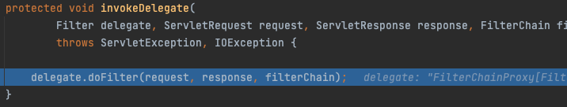

# FilterChainProxy

이전에 `DelegatingFilterProxy`에서 클라이언트로부터 들어온 요청 처리를 위임할 대상을 `FilterChainProxy`로 저장해 둔다고 했다.<br>
이 `FilterChainProxy는` 무엇일까?

`FilterChainProxy`는 스프링 시큐리티에 의해 제공되는 특별한 필터인데, `SecurityFilterChain`을 통해 `Filter` 구현체들에게 위임할 수 있도록 해주는 필터이다. <br>
`FilterChainProxy`도 빈이기 때문에 `DelegatingFilterProxy`에 래핑되어 있다.


위 코드를 보면 `DelegatingFilterProxy`가 `Filter` 타입의 delegate를 포함하는 것을 볼 수 있는데 이게 `FilterChainProxy`이다.


`initDelegate` 메서드에서 delegate를 초기화 시키는데 targetBeanName을 통해 `FilterChainProxy`를 등록시키는 것을 확인할 수 있다.

## SecurityFilterChain
그러면 `SecurityFilterChain` 을 통해 `Filter` 구현체들에게 위임을 허용할 수 있도록 해준다고 했는데, 이 `SecurityFilterChain`은 무엇일까?

`SecurityFilterChain`은 `FilterChainProxy`가 클라이언트로부터 들어온 요청을 어떤 필터를 거쳐야 하는지 결정하는데 사용된다.<br>


`SecurityFilterChain` 안에 있는 `Security Filter` 들은 전부 전형적인 빈이지만 `DelegatingFilterProxy`에 등록되는 것이 아닌, `FilterChainProxy`에 등록이 된다.<br>

이는 `SecurityFilterChain`이 호출되어야 하는 때를 결정하는데 도움이 된다.
- 서블릿 컨테이너에서 필터는 URL만을 기반으로 호출되지만 `FilterChainProxy`는 RequestMatcher 인터페이스를 이용해서 HttpServletRequest의 어떤 항목으로도 호출을 결정할 수 있다.

```java
public interface SecurityFilterChain {

	boolean matches(HttpServletRequest request);

	List<Filter> getFilters();

}
```

실제로 `SecurityFilterChain` 인터페이스를 보면 `matches` 메서드를 제공하고 있고 메서드의 파라미터로 HttpServletRequest를 받고 있다. <br>
실제 애플리케이션이 동작할 때는 `DefaultSecurityFilterChain`이 등록된다. 코드를 보면 훨씬 이해가 잘간다. (코드 중 일부만 가져온 것이다.)

```java
public final class DefaultSecurityFilterChain implements SecurityFilterChain {

    private final RequestMatcher requestMatcher;

    @Override
	public boolean matches(HttpServletRequest request) {
		return this.requestMatcher.matches(request);
	}

    ...
}
```

실제로, `FilterChainProxy`는 어떤 `SecurityFilterChain`을 사용할 지 결정하는데 사용된다. 이를 통해서 애플리케이션의 여러 슬라이스에 대해서 완전히 별도의 다른 구성을 적용할 수 있다.


다시 돌아와서, `FilterChainProxy`의 동작과정을 살펴보자.

애플리케이션에 /api/members 라는 URL로 요청을 보내보자.


먼저 `DelegatingFilterProxy`의 `initDelegate` 메서드가 호출이 되고 delegate에 `FilterChainproxy`가 등록이 된다.




이후 `invokeDelegate` 메서드가 호출이 되면서 `FilterChainProxy`의 doFilter 메서드가 호출이 된다.<br>
그러면 `FilterChainProxy`의 doFilterInternal 메서드가 호출이 되면서 내부에서 `virtualFilterChain`의 doFilter 메서드가 호출이 된다. `virtualFilterChain`은 `FilterChainProxy` 안에 있는 내부 static final 클래스인데 FilterChain 인터페이스를 구현하고 있다.


그러면 `FilterChainProxy` 내부에 있는 additionalFilters의 필터들을 차례로 하나씩 거치게 되는데, 이 배열에 스프링 시큐리티가 자동으로 등록해준 필터와 내가 등록한 필터가 순서에 맞게 등록되게 된다.

이제 모든 필터를 거치고 url에 맞게 등록한 핸들러(컨트롤러)가 호출되어 비즈니스 로직을 처리하게 된다.

## 참고 자료
[스프링 시큐리티 레퍼런스](https://docs.spring.io/spring-security/reference/servlet/architecture.html)