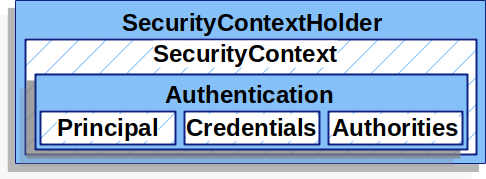
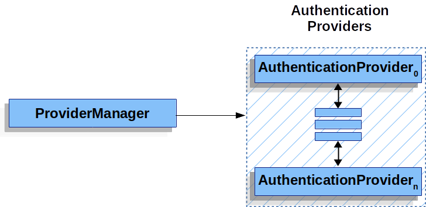

# 서블릿 인증 아키텍처

## SecurityContextHolder
Spring Security의 인증 모델의 핵심은 `SecurityContextHolder`이다.
`SecurityContextHolder`는 이름에서도 알 수 있듯이 `SecurityContext`를 가지고 있다.



[출처 Spring 공식문서](https://docs.spring.io/spring-security/reference/servlet/authentication/architecture.html)

`SecurityContextHolder`는 어떤 사용자가 인증되었는지에 대한 정보들을 저장하고 있다. SpringSecurity는 이 `SecurityContextHolder`가 어떤 방식으로 채워지는지 알 수 없다. 만약 값을 가지고 있다면 현재 인증된 사용자를 가져올 수 있다.

```java
SecurityContext context = SecurityContextHolder.createEmptyContext();  // 1
Authentication authentication = 
    new TestingAuthenticationToken("username", "password", "ROLE_USER"); // 2
context.setAuthentication(authentication);

SecurityContextHolder.setContext(context);  // 3
```

1. SecurityContext 인스턴스를 생성한다. <br>
    이떄 SecurityContextHolder.getContext().setAuthentication(authentication); 메서드를 사용할 수 있지만, 멀티 스레드 환경에서의 race condition을 피하기 위해 새로운 SecurityContext 인스턴스를 생성한다.
2. Authentication 타입의 인스턴스를 생성한다. <br>
    Spring Security는 어떤 Authentication의 구현체가 SecurityContext에 와도 상관이 없다.<br>
    위에서는 TestingAuthenticationToken이라는 구현체를 사용하고 있다.
3. 마지막으로 SecurityContextHolder에 위에서 생성한 SecurityContext를 넣는다.

`SecurityContextHolder`는 기본적으로 `ThreadLocal`을 사용해서 인증 정보를 저장한다. <br>
이 떄문에 같은 스레드에서는 항상 같은 인증 정보로 접근이 가능하다. <br>
이후에 인증정보가 겹치지 않게 요청 처리가 완료된 thread의 인증정보를 비워줘야 하는데 이는 SpringSecurity의 `FilterChainProxy`가 clear하도록 보장하고 있다.

## SecurityContext
그러면 `SecurityContext`에 대해서 알아보자.<br>
`SecurityContext`는 위의 사진에서도 알 수 있듯이 `SecuityContextHolder`에서 얻을 수 있고 `Authentication` 객체를 포함하고 있다.

코드는 다음과 같다.
```java
public interface SecurityContext extends Serializable {

	Authentication getAuthentication();

	void setAuthentication(Authentication authentication);
}
```
`getAuthentication`과 `setAuthentication` 메서드를 통해 `Authentication` 정보를 가져오거나 설정할 수 있다.

## Authentication
`SecurityContext`에서 얻을 수 있는 `Authentication`에 대해 알아보자.<br>
`Authentication`은 인증된 사용자의 정보를 담고 있는 토큰과 같은 객체이다. 

코드를 살펴보면,
```java
public interface Authentication extends Principal, Serializable {

    Collection<? extends GrantedAuthority> getAuthorities();

    Object getCredentials();

	Object getPrincipal();
    
    Object getDetails();

	boolean isAuthenticated();

    void setAuthenticated(boolean isAuthenticated) throws IllegalArgumentException;
}
```

- authorities
    - 사용자의 권한 목록
- principal
    - 사용자를 식별하는 객체 / Username과 Password를 가지고 인증할 때 UserDetails 인스턴스로 사용된다.
- credential
    - 주로 사용자의 비밀번호이다. 
- details
    - 인증 부가 정보
- authenticated
    - 인증 여부

## AuthenticationManager
`AuthenticationManager`는 Spring Security의 필터들이 어떻게 authentication을 수행하게 할지 정의한 API이다.<br>
반환된 `Authentication`은 `AuthenticationManager`에 의해 실행된 필터들에 의해 `SecurityContextHolder`에 들어간다.

```java
public interface AuthenticationManager {

	Authentication authenticate(Authentication authentication) throws AuthenticationException;
}
```

일반적으로 `AuthenticationManager`의 구현체는 `ProviderManager`이다.

## ProviderManager
위에서도 설명했듯이 `ProviderManager`는 `AuthenticationManager`의 구현체이다.<br>
특정 인증 유형을 확인할 수 있는 `AuthenticationProvider` 리스트를 가지고 있는데, `ProviderManager`는 이`AuthenticationProvider` 리스트에게 인증처리를 위임한다. 즉, `AuthenticationProvider` 목록 중 인증처리 조건에 맞는 적절한 Provider를 찾아 인증처리를 위임하는 클래스이다.



[출처 Spring 공식문서](https://docs.spring.io/spring-security/reference/servlet/authentication/architecture.html)

## AuthenticationProvider
`AuthenticationProvider`는 다음과 같이 두 개의 메서드를 제공한다.

```JAVA
public interface AuthenticationProvider {

	Authentication authenticate(Authentication authentication) throws AuthenticationException;

	boolean supports(Class<?> authentication);

}
```

- authenticate
    - 실질적인 인증 처리를 수행하는 메서드
- supports
    - 인증 처리가 가능한 Provider인지 확인하는 메서드

예를 들어 `DaoAuthenticationProvider`는 username/password를 기반으로 인증과정을 수행한다.

## 참고 자료

[Spring docs](https://docs.spring.io/spring-security/reference/servlet/authentication/architecture.html)