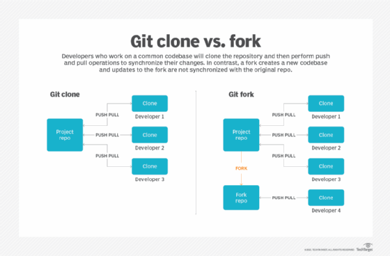

# [우아한테크코스] 프리코스 - 1주차

이번에 우아한 테크코스에 지원하게 되면서 프리코스를 시작하게 되었다.

1주차는 주어진 세 가지의 요구사항에 맞추에 기능을 구현하는 과제로 시작했다.
- 기능 요구사항
- 프로그래밍 요구사항
- 과제 진행 요구 사항

문서가 잘 정리 되어 있어서 이해하는데는 어려움이 없었고, 바로 과제를 시작하게 되었다.

기능 요구사항은 7가지의 기능 요구 사항을 모두 해결하는 것이었는데, 메일에서도 안내 받았듯이 가벼운 미션으로 준비되어 있었다.

나는 백엔드에 지원을 했기 때문에 자바를 통해 기능들을 구현해야 했었다. 주어진 문제들이 아예 손도 못댈정도의 난이도는 아니기 때문에 고민하면 충분히 해결할 수 있는 문제였다. 하지만 이번 우아한테크코스에서 온 메일에서도 나와있듯이 '언어'의 학습에도 게을러지지 않도록 노력했다. 문제를 해결하면서 `HashMap`을 사용하는 경우가 있었는데, 동작원리에 대해서는 깊게 생각해보지 않아 이번 기회에 제대로 학습해보자! 라는 생각으로 학습을 진행했다. 이는 따로 [이곳 - HashMap](../../자바/HashMap.md)에 남겨두었다.

문제는 git에 대한 이해였는데, 이전까지 git을 사용하면서 기계처럼 "파일을 변경했으니까 git add를 하고, commit 메시지를 남겨둔 다음에, git push를 해서 github에 올려야겠다"라는 메커니즘으로 사용했다. 하지만 막상 "그래서 git이 뭐에요?" 라고 나 자신에게 물어보니 답할 수 없었다. 그래서 학습을 하고 이곳에 적어보려 한다.

우선 진행 가이드에 나온 키워드를 위주로 학습을 진행하면서 필요한 지식들을 정리했다.

## Remote / Origin
`Remote`는 리모트 서버 자체를 의미하는데, 외부에 있는 서버에 우리의 소스를 저장한다고 생각하면 된다.<br>
이때 이 서버를 제공해주는 것이 `Github` 인 것이다. <br>

Git을 사용할 때 내가 변경사항을 어떤 리모트 서버에 올릴지 결정해야 하는데, 하나의 리모트 서버만 사용할 수 있는 것이 아니므로 내가 사용하는 리모트 서버의 이름을 정해줘야 한다. 이때 관례적으로 사용하는 이름이 `Origin`이라고 한다.

## git fork
> *"프로젝트를 자신의 계정으로 fork하기"*

`fork`는 다른 사람의 github repository에서 내가 추가적인 작업을 수행하고자 할 때 이 repoistory를 내 github repository에 그대로 복제하는 기능이다.

## git clone
> *"fork한 저장소를 자신의 컴퓨터로 clone하기"*

clone은 리모트 서버의 repository에서 내 로컬 환경에 파일을 복사하는 행위를 말한다. <br>
이때 clone을 수행하기 위해서 *어떤 레포지토리*에서 파일을 가져올 것인가에 대한 정보가 필요하고, 이 정보는 URL로 표현된다.

이 때문에 다음과 같은 코드를 작성해야 한다.
```
git clone https://github.com/{본인_아이디}/{저장소 아이디}.git
```



[출처 - https://www.theserverside.com/answer/Git-fork-vs-clone-Whats-the-difference]

여기까지가 나의 로컬환경으로 woowacourse-precourse/java-onboarding repository를 복사하는 과정이다.

이후에는 내가 작성한 코드들을 어떻게 이 리모트 서버에 올리는지에 대한 과정을 말하고자 한다.
<br>
프리코스 과제 가이드 문서에 따르면 다음과 같은 과정을 통해 저장소에 변경된 부분을 반영한다고 한다.

```git
git checkout -b {본인 아이디}
git status // 변경된 파일 확인
git add -A(또는 .) // 변경된 전체 파일을 한번에 반영
git commit -m "메시지" // 작업한 내용을 메시지에 기록
git push origin 브랜치이름
```

git checkout, git status, git add, git commit, git push대해 알아보자!

## git checkout
> *"기능 구현을 위한 브랜치 생성"*

git checkout은 브랜치를 전환하는 작업이다. 이때 -b 옵션이 의미하는 바는 브랜치 작성과 동시에 해당 브랜치로 이동하겠다는 의미이다.<br>

## git status
git status는 말 그대로 git에 의해 관리되는 파일의 상태에 대한 내용이다.<br>

먼저 로컬 환경의 파일들은 `Tracked`, `UnTracked` 두 가지 상태로 나뉜다. 
- `Tracked` 상태는 git이 파일을 추적해서 변경사항들을 감지한다는 의미이다. 
- `UnTracked` 상태는 git이 변경사항들을 감지하지 않는다는 의미이다.

이 `Tracked` 상태는 다시 `Unmodified`, `Modified`, `Staged` 상태로 나뉘게 된다.<br>
- 스테이지 에이리어 (커밋을 하기 위해 $git add 명령어로 추가한 파일이 있는 공간)에 있는 파일들은 `Staged` 상태이다.
- `Staged` 파일들을 커밋하게 되면 하나의 커밋으로 저장된 후 `Unmodified` 상태로 변경된다.
- `Unmodified` 상태의 파일을 수정하면 `Modified` 상태로 변경된다.

실제로 터미널에 git status 명령어를 입력하면 다음과 같은 내용이 나온다.
```
(base) userui-MacBookPro:java-onboarding user$ git status
현재 브랜치 23Yong
브랜치가 'origin/23Yong'에 맞게 업데이트된 상태입니다.

추적하지 않는 파일:
  (커밋할 사항에 포함하려면 "git add <파일>..."을 사용하십시오)
        .DS_Store

커밋할 사항을 추가하지 않았지만 추적하지 않는 파일이 있습니다 (추적하려면 "git
add"를 사용하십시오)
```
여기서 내가 어떤 파일을 변경하면 다음과 같이 나온다.
```
(base) userui-MacBookPro:java-onboarding user$ git status
현재 브랜치 23Yong
브랜치가 'origin/23Yong'에 맞게 업데이트된 상태입니다.

커밋하도록 정하지 않은 변경 사항:
  (무엇을 커밋할지 바꾸려면 "git add <파일>..."을 사용하십시오)
  (use "git restore <file>..." to discard changes in working directory)
        수정함:        src/main/java/onboarding/Problem6.java

추적하지 않는 파일:
  (커밋할 사항에 포함하려면 "git add <파일>..."을 사용하십시오)
        .DS_Store

커밋할 변경 사항을 추가하지 않았습니다 ("git add" 및/또는 "git commit -a"를
사용하십시오)
```
여기서 `src/main/java/onboarding/Problem6.java` 파일이 `Modified` 상태라고 생각할 수 있고 .DS_Store가 `UnTracked` 상태라고 생각할 수 있겠다!

## git add
git add는 파일의 변경사항들을 스테이지 에이리어로 올리는 명령어이다. 이때 git add <파일경로>를 통해 올리고자 하는 파일을 선택할 수도 있다.

## git commit
git commit은 스테이지 에이리어에 올라가있는 변경 사항들을 포장하는 행위라고 생각하자.<br>
Git은 이 commit을 하나의 버전으로 정의하고 있는데, 그렇기 때문에 기능단위의 커밋을 수행하라는 말을 깨달았다.

또한 이 커밋에는 메시지를 담을 수 있는데, 인터넷에는 좋은 커밋 메시지에 대해 많은 글들이 나와있다.<br>
이번에 나는 일관되게 작성하기 위해 노력했고 커밋 메시지를 보면 어떤 부분에 대해 커밋했는지 적을려고 노력했다.

## git push
git push는 커밋을 통해 포장한 변경사항들을 리모트 서버로 업로드하는 과정이다. 이때 변경사항들을 실제 리모트 서버에 올리는 것이기 때문에 네트워크에 연결되어 있어야 한다고 한다. 또한 push를 진행할 때는 `어떤 리모트 서버에 어떤 브랜치로 push할 것인지도 알려줘야 한다.` 그렇기 때문에 다음과 같이 push 한다.

```
git push origin javajigi    // origin 서버의 javajigi 브랜치로 push
```

여기까지 git의 기본들을 학습해보는 시간을 가졌다. 이전까지 git을 사용은 하고 있었지만 제대로 알고 사용하는 것보다는 사용하는 커맨드를 외운 후에 그냥 사용하는 것이었다면, 이제는 변경사항들을 추적, 관리해주는 git을 이용해서 github라는 리모트 서버에 올린다! 라는 생각을 거치게 되었다.

## 참고 자료
[git checkout](https://backlog.com/git-tutorial/kr/stepup/stepup2_3.html)

[git status](https://seonkyukim.github.io/git-tutorial/git-status/)

[git 뉴비를 위한 기초 사용법](https://evan-moon.github.io/2019/07/25/git-tutorial/)
