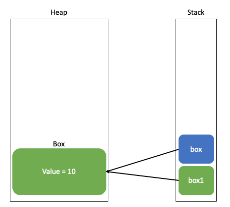
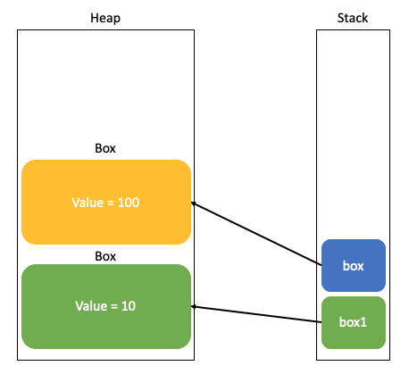

# 자바에는 Call By Reference가 없다.

자바에는 Call By Reference가 없다. 그 이유를 알기 전에 Call By Value와 Call By Reference에 대해 먼저 학습하자.

Call By Value란 이름 그대로 값에 의한 호출이란 뜻이다. 파라미터로 넘어온 값이 원래의 값이 아니라 복사된 값이다.<br>
C언어로 먼저 알아보자.

```c
void changeNum(int num) {
    num = 100;
}

int main() {
    int num = 10;
    printf("%d\n", num);

    changeNum(num);
    printf("%d", num);
}

/**
    10
    10
**/
```

Call By Reference란 참조에 의한 호출이라는 뜻인데, 파라미터로 전달받은 값을 직접 참조한다.
```c
void changeNum(int* num) {
    *num = 100;
}

int main() {
    int num = 10;
    printf("%d\n", num);

    changeNum(&num);
    printf("%d", num);
}

/**
    10
    100
**/
```
원본의 값이 변경되는 것을 확인할 수 있다.<br>
이제 Call By Value 와 Call By Reference에 의해 어느정도 알았으니 자바로 넘어가보자.

## 왜 자바에는 Call By Reference는 없고 Call By Value만 있는가?
자바는 항상 Call By Value를 사용한다. 이는 메서드의 파라미터로 넘어온 값이 모두 복사본이라는 것이고, 넘어온 원본의 값을 변경할 수 없다는 것이 된다. <br>
그런데 자바에서 객체를 넘겨 객체의 값을 수정하면 원본도 같이 수정되기 때문에 이를 Call By Reference라고 잘못 생각할 수 있다.

다음 코드를 보자.
```java
public class Main {

    static class Box {
        int value;

        public Box(int value) {
            this.value = value;
        }

        public void setValue(int value) {
            this.value = value;
        }
    }

    private static void changeValueInBox(Box box) {
        box = new Box(100);
    }

    public static void main(String[] args) throws IOException {
        Box box1 = new Box(10);
        System.out.println("Before : " + box1.value);

        changeValueInBox(box1);
        System.out.println("After : " + box1.value);
    }

    /**
        Before : 10
        After : 10
    **/
}
```
box를 메서드의 파라미터로 넘겨 box에 새로운 Box 인스턴스를 할당해주고 있는 코드이다.<br>
만약 Call By Reference라면 100이 출력되어야 하겠지만 그렇지 않다.



처음 `changeValueInBox(box1)` 호출하기까지의 메모리 모습이다.<br>
파라미터로 받은 box의 값이 box1의 주소값을 복사해서 독자적인 값을 가지게 된다. (주소 값을 복사하는 Call By Value 발생!)

다음 부분을 보자.



`changeValueInBox` 메서드에서 파라미터로 받은 `box`의 값에 새로운 인스턴스를 할당해주게 된다.<br>
`box`는 결국 `box1`의 값을 복사한 것이기 때문에 `main`메서드 안에 있는 `box1`의 값에 아무런 영향을 주지 못한다.