# GC

## Garbage Collection
Java에서는 개발자가 프로그램의 메모리 영역을 명시적으로 해제하지 않기 때문에 가비지 컬렉터가 메모리를 회수하는 작업을 수행한다. 

이 가비지 컬렉터는 다음 두 가지의 가정을 가지고 만들어 졌다.
1. 대부분의 객체는 금방 접근 불가능 상태(unreachable)가 된다.
2. 오래된 객체로부터 젊은 객체로의 참조는 아주 적게 존재한다.

이 가설의 장점을 최대한 살리기 위해 JVM은 메모리 영역을 두 가지로 나누었다.
- Young 영역
- Old 영역 

## Young 영역
Young 영역은 다음의 세 가지 영역으로 나뉜다.
- Eden
- Survivor (2개)
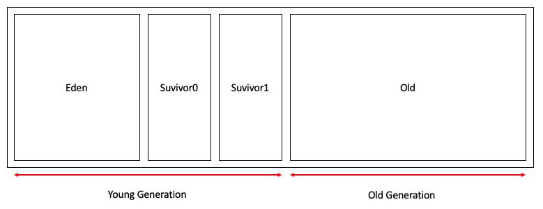

각 영역의 처리 순서는 다음과 같다.
1. 대부분의 새로 생성된 객체는 Eden 영역에 들어가게 된다.
2. Eden 영역에서 GC가 발생하면 살아남은 객체는 Survivor 중 한 곳으로 넘어가게 된다.
3. 또 다시 Eden 영역에서 GC가 발생하면 살아남은 객체는 이미 객체가 있는 Survivor 영역에 넘어가게 된다.
4. 이후 Survivor 영역이 가득차게 되면, 그 중에서 살아남은 객체를 비어있는 Survivor 영역에 넘어가게 된다. 
그리고 기존에 있던 Survivor 영역은 빈 상태가 된다.
5. 이 과정을 반복하다가 계속해서 살아남은 객체는 Old 영역으로 넘어가게 된다.
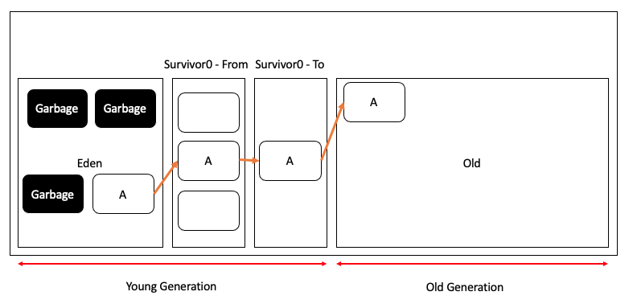

Survivor 영역 중 하나는 반드시 비어있는 상태로 두어야 한다. 

> 그런데 Old 영역에 있는 객체가 Young 영역을 참조할 경우는 어떻게 처리될까? 
> Card Table 이라는 512 바이트의 덩어리로 되어있는 것이 있다.  
> 만약 Young 객체를 참조하는 Old 객체가 있다면, 그 Old 객체의 시작주소에 해당하는 카드를 dirty로 표시한다.
> 만약 이 Reference가 사라지게 되면 dirty 표시도 사라지게 된다. 
> 그래서 Young 영역에 대한 GC를 수행할 때는 Old 영역의 모든 객체를 참조하지 않고, 이 카드 테이블만 뒤져서 GC 대상인지 식별한다.

## Old 영역
Old 영역은 데이터가 가득 차면 GC를 수행한다. GC 방식에 따라서 처리 절차가 달라지게 되는데, 각 GC 방식을 알아보자.

- Serial GC
- Parallel GC
- Parallel Old GC
- Concurrent Mark & Sweep GC (CMS GC)
- G1 GC

## GC와 단편화 문제
GC는 참조되지 않는 객체들을 정리하는 작업인데, 결국 새로운 객체의 생성을 위해 한정된 힙 공간을 재사용하기 위해 수행하는 작업이다. 
GC 수행 후 힙 메모리에서 제외된 객체들로 인해 메모리는 단편화 문제가 발생한다.   이러한 현상을 방지하기 위해서 Compaction 과 같은 알고리즘을 수행한다. 각 GC 방식에서 이를 어떻게 해결했는지도 살펴보자.

## Serial GC
Young 영역에서의 GC는 위에서 설명했던 방식과 동일하게 진행된다. 
Old 영역에서의 GC는 Mark-Sweep-Compact라는 알고리즘을 사용한다.  
이 알고리즘을 단계별로 설명하자면,

1. Old 영역의 살아있는 객체를 식별한다. (mark)
2. 그 다음에는 힙 영역의 앞부분부터 확인하여 살아남은 것을 넘긴다. (sweep)
3. 마지막은 각 객체들이 연속되게 쌓이도록 힙의 앞부분부터 채워 객체가 존재하는 부분과 객체가 존재하지 않는 부분으로 나눈다. (compaction)

## Parallel GC
Parallel GC는 Serial GC와 기본적인 알고리즘은 같다. 차이점은 Parallel GC는 GC를 수행하는 스레드가 여러 개라는 것이다. 
그렇기에 Serial GC보다 작업을 빠르게 수행할 수 있다.

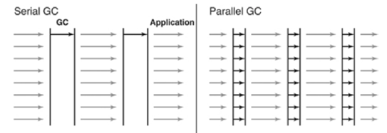

[출처: naver D2 https://d2.naver.com/helloworld/1329]

대신 Young generation에만 국한되어 있다는 점을 알아두자.

> 메모리의 특성상, 같은 메모리 공간을 두 스레드나 프로세스가 접근하게 되면 문제가 발생한다.  
> 그렇기 때문에 동기화작입이 필요한데 Lock이 발생할 수 밖에 없고, lock-contention이 발생할 수 있다.  
> 이를 해결하기 위해 나온 것이 TLABs (Thread-Local Allocation Buffers) 이다.
> 각 스레드가 각 몫에 해당하는 Eden 영역에 작은 덩어리를 가질 수 있도록 하는 것이다. 즉, 스레드마다 Eden 영역에 일정 부분을 미리 할당해 놓는 다는 것이다.

> lock-contention은 starvation 현상과 비슷한데, lock을 획득하고자 하는 스레드가 두 개이상일 경우, 서로 경쟁하며 lock을 얻게 되는데 이로 인해 lock을 더 획득한 스레드와 덜 획득한 스레드가 생긴다. 
> 심한 경우 다른 스레드가 여러 번 lock을 획득하는 동안 한 번도 lock을 획득하지 못한 스레드가 생길 수 있다. 이를 lock-contention 이라한다. 

## Parallel Old GC
Parallel Old GC는 Parallel GC와 비교해서 Old 영역의 GC 알고리즘이 다르다. 
이 방식은 Mark-Summary-Compaction 과정을 거친다. 
Summary 단계는 앞서 GC를 수행한 영역에 대해서 별도로 살아있는 객체를 식별한다는 점에서 Sweep 단계와 다르며, 더 복잡하다.

## Concurrent Mark-Sweep GC

CMS는 GC과정에서 발생하는 STW(Stop-The-World) 시간을 최소화하는데 초점을 맞춘 GC 방식이다. 
Old Generation에 대해서 Concurrent Mark-Sweep 알고리즘을 사용했는데, Compaction 과정이 없다는 것을 기억하자.

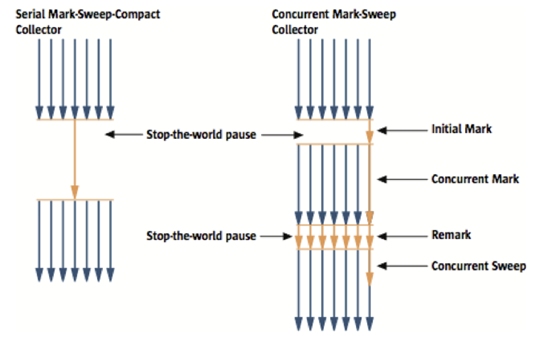

[출처: naver D2 https://d2.naver.com/helloworld/1329]

- 초기 Initial Mark 단계는 싱글 스레드로 동작을 하는데, 직접 참조되는 객체들만 빠르게 구별해 내는 과정이다. STW 시간이 매우 짧다. 
- Concurrent Mark 단계는 GC 스레드와 애플리케이션 스레드가 동시에 수행중인 단계이다. Initial Mark 단계에서 선별된 객체에서 참조하고 있는 객체들을 따라가며 확인한다.
- Remark 단계는 말 그대로 mark 작업을 다시 수행하는데, Concurrent Mark 단계에서 새로 추가되거나 참조가 끊긴 객체를 확인한다.
모든 스레드들이 GC에 동원되며 애플리케이션의 수행은 잠시 중단된다. (STW) Initial Mark 작업보다 작업량이 많기 때문에 가용한 모든 스레드를 동원해 수행시간을 단축시킨다. 
- Concurrent Sweep 단계는 Remark 작업을 통해 최종으로 Live 객체로 판명된 객체를 제외한 참조가 끊긴 객체를 모두 지우는 작업이다. 대신 STW 없이 작업을 수행한다.

이처럼 STW 시간이 매우 짧아 애플리케이션의 응답속도가 매우 중요할 때 사용된다. 
하지만 위에서 말했듯이 Compaction 과정이 기본적으로 제공되지 않는다. 그래서 조각난 메모리가 많아 Compaction 과정을 수행하면 다른 GC방식보다 STW의 시간이 더 길게 나올 수 있다. 그렇기 때문에 Compaction 과정이 얼마나 자주, 오랫동안 수행되는지 확인해야 한다.

## G1(Garbage First) GC
G1 GC는 자바 9부터 기본 GC로 채택된 GC이다.  

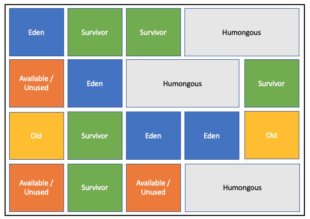

G1 GC는 앞에서 얘기했던 Young, Old 영역으로 힙을 구분한 것을 잊어버리는게 좋다.  
물론 Young, Old 영역이 존재하지만 해당 영역은 고정된 크기가 아니라 전체 힙 메모리를 region이라는 특정한 크기로 나눈다. 
새로운 영역을 확인할 수 있는데, Humongous 영역과 Available/Unused 영역이다.

- Humongous 영역은 region 크기의 50%를 초과하는 큰 객체를 저장하기 위한 공간이다.
- Available/Unused 영역은 아직 사용되지 않은 region이다.

### 왜 G1 GC인가?
G1 GC는 region 중에 모든 객체가 죽은 region 부터 회수를 수행한다.  
메모리 회수를 수행하면 빈 공간의 확보를 빠르게 할 수 있고, 조기 승격이나 할당률이 늘어나는 것을 방지할 수 있다.  
다른 컬렉터와 달리 죽은 객체들만 있는 region(Garbage)부터 먼저(First) 회수를 해서 G1 GC이다.

> Evacuation
> Minor GC 이후 Survivor 영역이나 Old 영역으로 객체를 옮겨야 하는 경우가 있는데, 이 때 해당 객체를 기존의 region이나 새로운 region에 복사 후 메모리를 compaction 한다. 이 행위를 evacuation 이라 부른다.
> Major GC도 마찬가지로, Old Generation region에 있는 live 객체를 다른 region으로 evacuation 시킨 후 메모리를 compaction 한다.
> 그런데 Old Generation 의 특수 영역인 Humongous region에 대해서는 evacuation이 발생하지 않고 해당 region의 객체가 죽으면 바로 회수해 간다.

### G1 GC의 Cycle
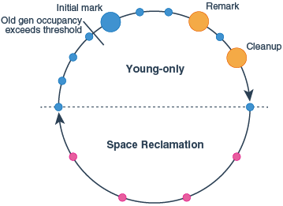

[출처 - Oracle G1 GC](https://docs.oracle.com/javase/9/gctuning/garbage-first-garbage-collector.htm#JSGCT-GUID-F1BE86FA-3EDC-4D4F-BDB4-4B044AD83180)

G1 GC는 위 그림처럼 두 단계를 반복해가며 작업을 수행한다. 
파란원은 Minor GC가 발생해서 STW가 발생하는 것이고, 
주황원은 Major GC가 발생해서 객체를 마킹하면서 생기는 STW이고, 
빨간원은 Mixed Collection(Minor/Major)이 발생하면서 STW가 발생하는 것이다.

### Young-only phase
Young-only phase는 Minor GC만 수행하다가 "Old gen occupancy exceeds threshold" 부분에서 -XX:InitiatingHeapOccupancyPercent(IHOP)에 지정한 값을 넘어가게 되면 MajorGC도 시작한다. 
Major GC의 첫 단계는 Initial Mark 단계이다. 이때 Minor GC도 함께 수행되면서 둘 다 STW가 발생한다. 이후 애플리케이션 스레드, Minor GC, Concurrent Mark가 동시에 수행되는데 Remark가 발생하는 순간 멈추게 된다. 
그리고 Remark가 발생하면서 STW가 발생한다. 이후 다시 Minor GC가 발생하다가 Clean up을 수행한다.

### Space Reclamation phase
Young only phase가 끝난후 Space reclamation phase가 시작되는데, 해당 phase에서는 Mixed GC가 수행된다. 이때의 STW 빈도는 Young-only phase보다 줄어드는데, mark 단계가 없기 때문이다. 
이제 이 단계가 끝나면 다시 Young-only 단계로 돌아가서 Minor GC만 수행한다.

이제 Minor GC, Major GC, Mixed GC에 대해 자세히 알아보자.

### Minor GC
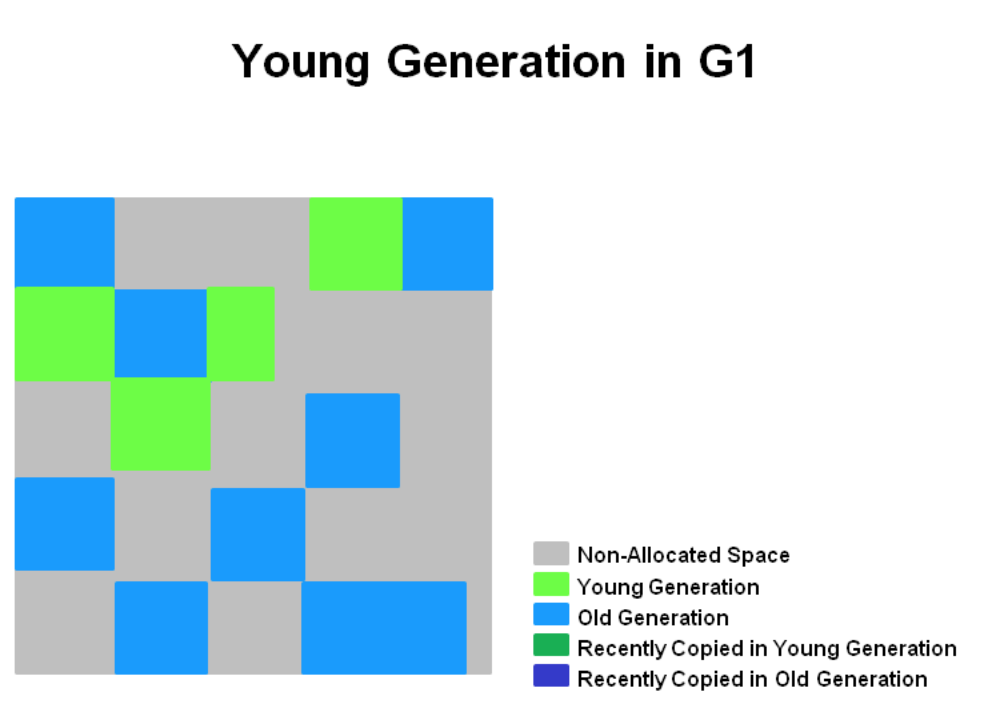
연속되지 않는 메모리 공간에 Young generation이 region 단위로 할당되어 있다.

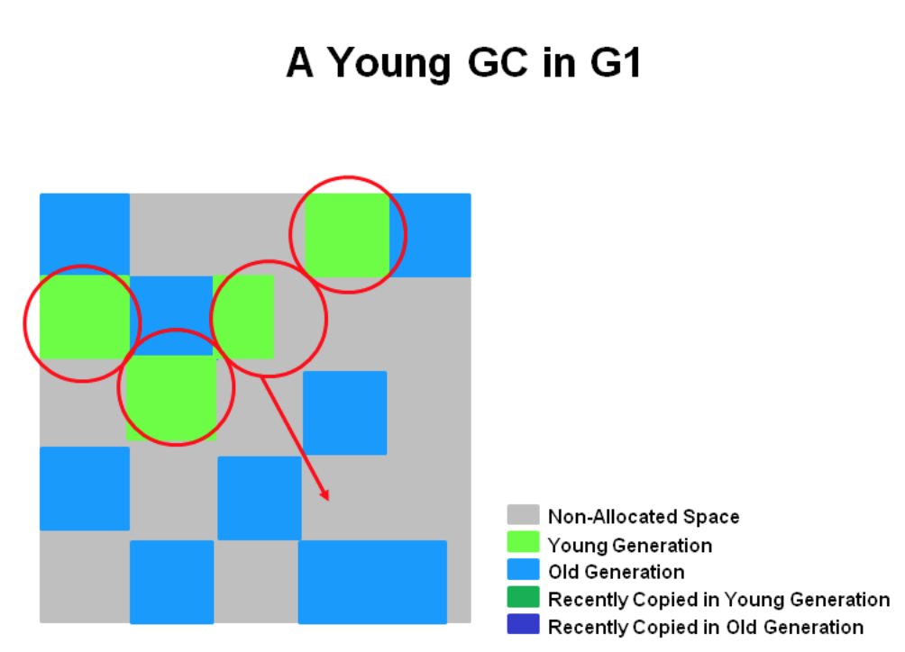
Minor GC는 기존 GC와 비슷하게 진행이 되는데, 멀티스레드 환경에서 병렬로 동작한다.
live 객체들이 Suvivor region으로 이동되고, 이중 aging thresold가 충족되는 경우 이 객체 중 일부가 old generation region으로 옮겨진다(evacuation). 이 단계에서 STW가 발생하고 eden region이나 survivor region은 다음 minor gc를 위해 다시 계산된다.

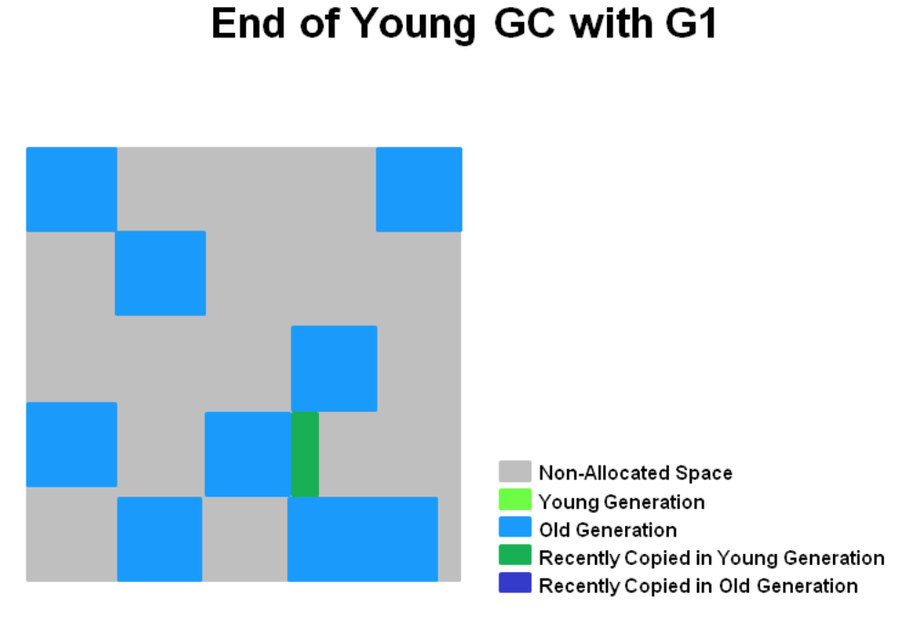
Minor GC를 모두 마친 후의 모습이다. live객체는 survivor이나 old generation 영역으로 이동하였고, 최근에 승격된 객체는 청록색 영역이다.

즉, G1 GC에서 Minor GC는 live 객체들을 survivor region이나 old generation으로 evacuation하는 작업이고 STW가 발생하며 이는 멀티스레드로 동작을 한다.

### Major GC
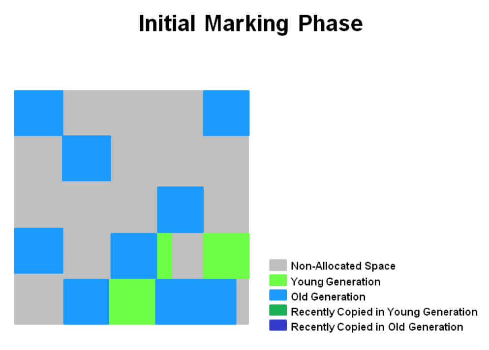

Initial Mark 단계는 Old region에 존재하는 객체들이 참조하는 Survivor region을 찾는 단계이다. 이는 STW를 발생시킨다.

이후 Root region scan 단계가 발생하는데, Initial Mark 단계에서 표시한 survivor region을 스캔해 Old region에 대해 참조하고 있는 객체를 마킹한다.

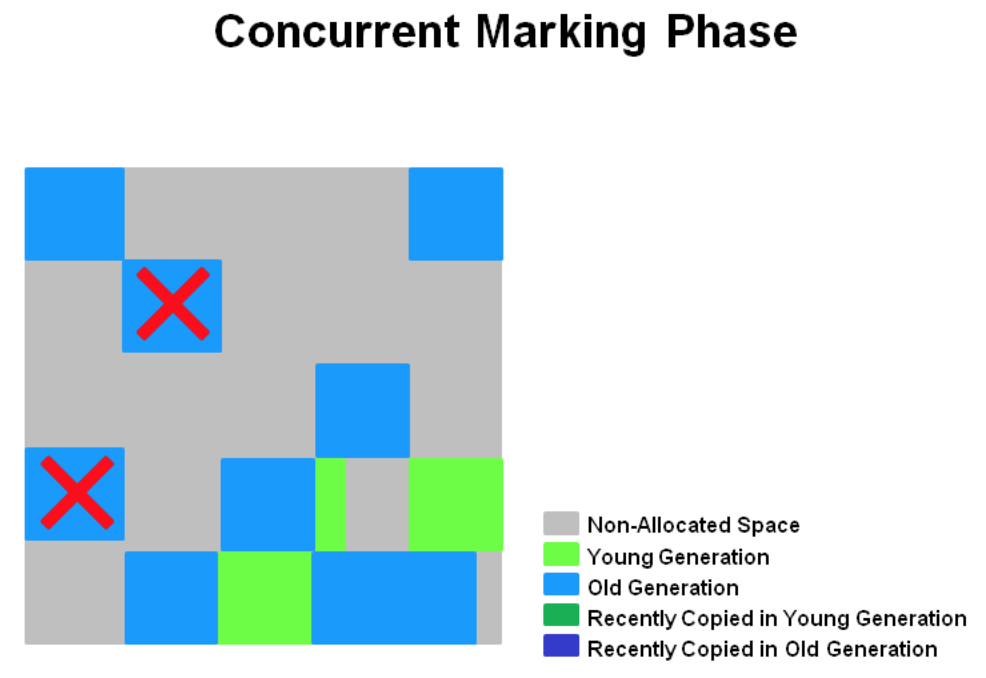

Concurrent Marking 단계는 Old Generation 내에 생존해 있는 모든 객체를 marking 한다. STW가 발생하지 않고 애플리케이션 스레드와 함께 동작한다. Minor GC와 함께 동작해 종종 Minor GC에 의해 인터럽트 당한다.

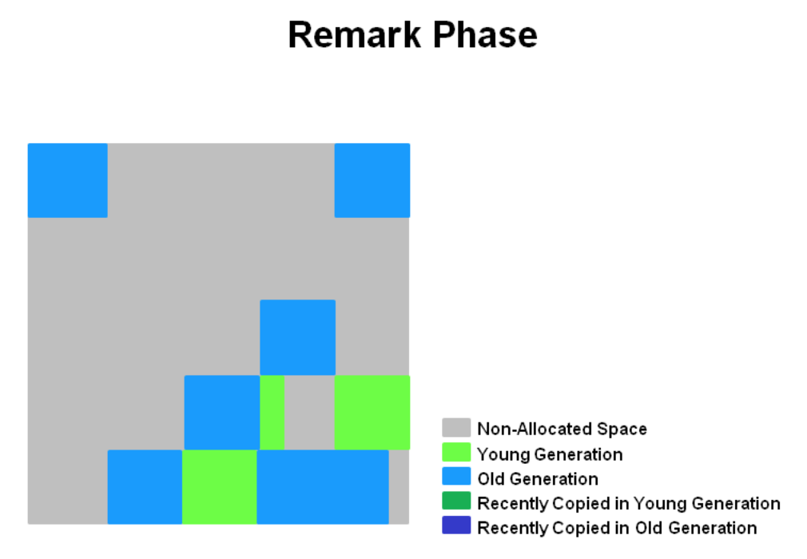

Remark 단계는 애플리케이션을 멈추고 (STW) 최종적으로 GC 대상에서 제외할 객체를 마킹한다. 이때 SATB (Snapshot-At-The-Beginning) 기법을 사용해서 CMS GC보다 빠르게 수행한다. 
SATB는 마킹 사이클의 시작에서 힙 메모리 내에 있는 접근 가능하거나 그 이후에 할당되는 객체를 live 객체로 간주하는 알고리즘이다.

> SATB states that any object that is live at the start of the concurrent marking (a marking over the entire heap) is considered live for the purpose of the collection. 

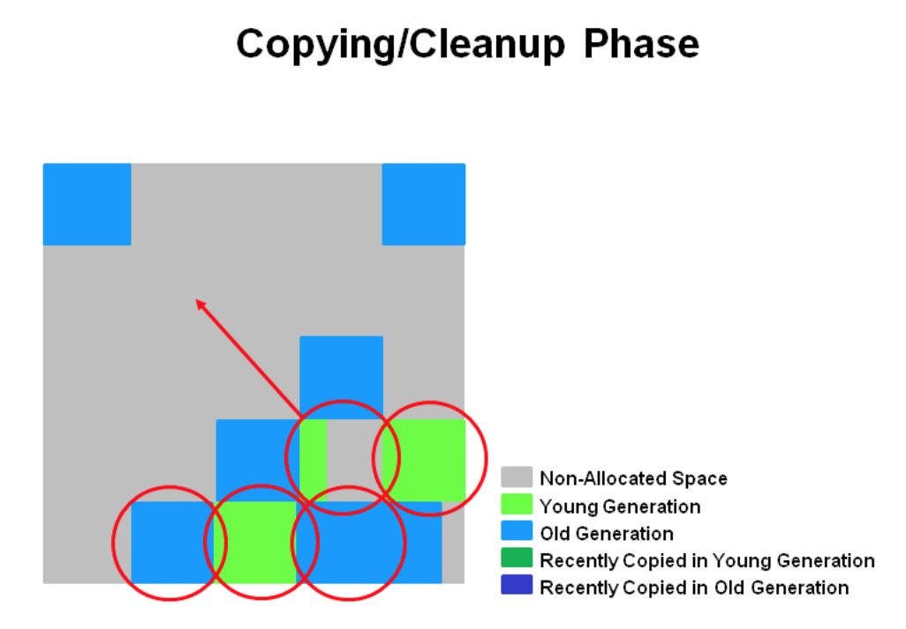

Cleanup 은 애플리케이션을 멈추고 살아있는 객체가 가장 적은 region에 대한 미사용 객체를 제거한다. 이후 Copying 과정에서 live 객체들을 evacuation 한 후 메모리 compaction을 수행한다.

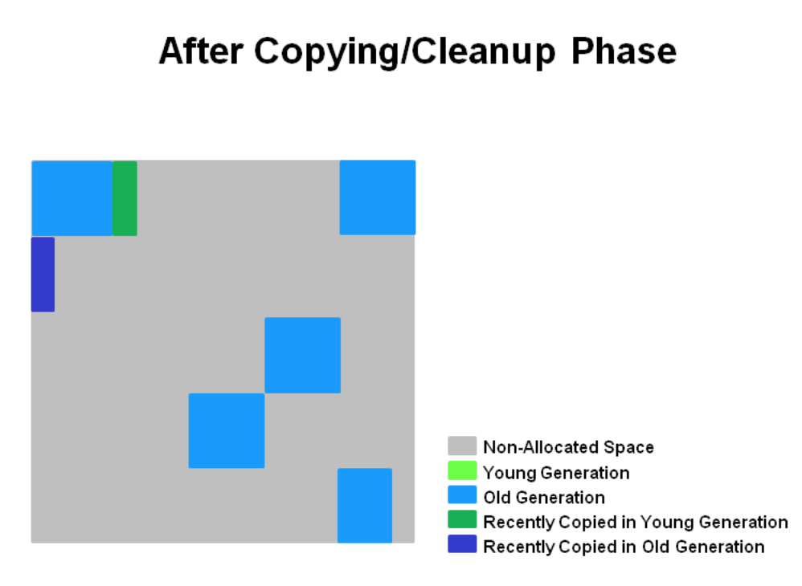

## 참고 자료
[NaverD2 - Java Garbage Collection](https://d2.naver.com/helloworld/1329)

[DZone - GC](https://dzone.com/articles/gc-explained-collectors-overview)

[Java의 GC는 어떻게 동작하나?](https://mirinae312.github.io/develop/2018/06/04/jvm_gc.html)

[Oracle - G1 GC](https://docs.oracle.com/javase/9/gctuning/garbage-first-garbage-collector.htm#JSGCT-GUID-F1BE86FA-3EDC-4D4F-BDB4-4B044AD83180)

[Java G1 GC의 동작과정](https://steady-coding.tistory.com/590)