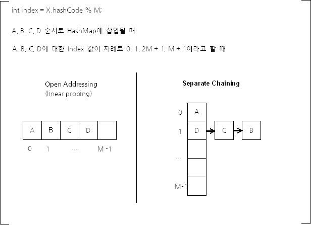

# HashMap

## HashTable
해시 테이블은 해시 함수를 사용해 변환한 값을 index로 삼아 key와 value를 저장하는 자료구조이다. <br>
자바에서의 [HashTable](https://docs.oracle.com/javase/8/docs/api/java/util/Hashtable.html)은 이러한 해시 테이블을 구현하고 있는 클래스이다. 어떠한 null이 아닌 객체든 key와 value값이 될 수 있다.

HashTable의 인스턴스는 성능의 영향을 미치는 두 개의 파라미터를 가지고 있다. 
- initial capacity
- load factor

`capacity`는 해시 테이블의 버킷 사이즈인데, initial capacity는 말 그래도 HashTable이 생성되었을 떄의 `capacity`를 말한다.<br>
`load factor`는 해시 테이블의 크기가 자동으로 커지기 전에 해시 테이블이 가득 찰 수 있는 정도를 나타낸다. 즉, 해시 테이블의 크기 대비 키의 개수를 말한다. 키의 개수를 M, 해시 테이블의 크기를 N이라 했을 때 `load factor`는 M/N 이 된다.

일반적으로 `load factor`의 기본 값은 0.75이다. 이 값은 시간과 메모리 공간의 비용 측면에서 적절한 trade-off를 제공해준다고 한다.


## HashMap과 HashTable
HashMap은 HashTable과 달리 보조 해시 함수(Additional Hash Function)을 사용하여 해시 충돌의 가능성을 낮추는데 차이가 있다. 

HashMap과 HashTable은 *'키에 대한 해시 값을 사용하여 값을 저장하고 조회하며, 키-값에 따라 동적으로 크기가 증가하는 `associate array`라고 할 수 있다.'* (Naver D2)

> associate array <br>
> associate array를 지칭하는 다른 용어로는 Map, Dicitonary, Symbol table이 있다.

## 해시분포와 해시충돌
해시층돌은 다른 내용의 key값이 같은 인덱스를 가지게 되는 경우를 말한다. 해시충돌로 인해 특정 키의 버킷에 데이터가 집중되어 O(1)의 시간복잡도를 제공하지 못할 수도 있다.

이는 자바에서 HashTable이나 HashMap에서 데이터를 저장할때 hashCode() 메서드를 이용해서 인덱스를 정하기 때문에 발생한다.<br>
hashCode() 메서드의 반환값은 int 인데 논리적으로 생성 가능한 객체의 수가 2^32 보다 많을 수 있고 2^32 만큼의 배열을 모든 HashMap이 가지고 있는 것은 메모리 낭비이기 때문에 정수 범위보다 작은 M개의 원소가 있는 배열을 사용한다.

```java
int index = X.hashCode() % M;
```

대신 위 코드와 같은 방식을 사용하면 서로 다른 객체가 1/M 확률로 같은 해시 버킷을 사용해 해시충돌이 발생하게 되고 이를 방지하기 위해서 Open Addressing 방식과 Seperate Chaining 방식을 사용할 수 있다.

Open Addressing 방식은 해시 충돌이 발생했을 경우 다른 버킷에 데이터를 집어넣는 방식이다. Open Addressing 방식에는 대표적으로 3가지 방법을 사용한다.
- 선형 탐색 (Linear Probing)
    - 해시충돌 시 다음 버킷 혹은 몇 개의 버킷을 뛰어넘어 데이터를 저장하는 방식
- 제곱 탐색 (Quadratic Probing)
    - 해시충돌 시 기존 해시값의 제곱만큼 건너뛴 버킷에 데이터를 삽입
- 이중 해시 (Double Hashing)
    - 해시충돌 시 다른 해시함수를 한 번 더 적용한 버킷에 데이터를 삽입

Linear Probing과 Quadratic Probing은 데이터가 밀집되는 클러스터링 문제가 발생할 수 있다.

Seperating Chaining은 해시충돌 시 해당 버킷에 LinkedList를 사용해 데이터를 저장하는 방식이다.



자바 HashMap은 이중 Seperating Chaining 방식을 사용하고 있다. HashMap에 저장된 키-값 데이터가 많아지면 Open Addressing은 Seperating Chaining 보다 느리다. 이는 Open Addressing의 경우 Worst Case 발생 빈도가 높아지기 때문이다.

## Java8 HashMap에서의 Seperating Chaining
Java8 부터 HashMap에서 데이터가 일정 개수보다 많아지면 LinkedList 대신 Tree를 사용해 log의 시간복잡도를 기대할 수 있게 되었다. 어떤 자료구조를 사용할 것인지에 대한 결정은 하나의 해시 버킷에 할당된 키-값 쌍 개수이다. Java8 이상부터는 상수형태로 기준을 정하고 있다.

```java
static final int TREEIFY_THRESHOLD = 8;

static final int UNTREEIFY_THRESHOLD = 6;  
```

즉 하나의 해시 버킷에 8개 이상의 데이터가 모이면 tree를 사용하고 데이터가 삭제되어 6개에 이르면 다시 linkedList를 사용한다는 의미이다. 차이를 2로 둔 것은 어떤 키-값 쌍의 데이터가 삽입/삭제가 반복되는 경우 불필요하게 tree와 linkedList를 변경하는 일이 반복되어 성능 저하가 발생할 수 있기 때문이다.

자바 HashMap에 사용하는 트리는 Red-Black Tree이다.<br>
Red-Black Tree는 자가 균형 이진 탐색 트리인데 기존 이진 탐색 트리의 불균형 문제를 해결하는 트리라고 보면된다.<br>

> [Red-Black Tree란?](https://zeddios.tistory.com/237) (이해하기 쉬운 블로그 글이 있어 가져와보았다..)

## 해시 버킷의 동적확장
HashMap은 키-값 데이터 쌍의 개수가 일정 개수 이상이 되면 해시 버킷의 크기를 두 배로 늘린다.<br>
해시 버킷의 크기의 기본 값은 16이고 데이터의 개수가 임계점에 이를 때마다 해시 버킷의 수를 두배로 늘린다. 최대 개수는 2^30개이다.
여기서 해시 버킷의 개수를 두 배로 늘리는 임계점은 현재 데이터의 개수가 `load factor * 현재 해시 버킷의 개수` 이다.<br>
그런데 이렇게 버킷의 개수를 두 배로 늘릴 때마다 모든 키-값 데이터를 읽어 새로운 Seperate Chaining 을 구성해야 하는 문제가 있다.
HashTable과 같이 HashMap 초기 생성자의 인자로 초기 해시 버킷의 개수를 지정할 수 있어, 해당 HashMap 객체에 저장될 데이터의 개수가 어느 정도인지 예측가능하면 이를 지정해 불필요하게 Seperate Chaining을 재구성할 필요가 없다.

```java
static final int DEFAULT_INITIAL_CAPACITY = 1 << 4; // aka 16
static final int MAXIMUM_CAPACITY = 1 << 30;
static final float DEFAULT_LOAD_FACTOR = 0.75f;
```

그런데 해시 버킷의 수를 두 배로 늘리는 결정적인 문제가 있다. 해시 버킷의 개수 M이 2^a 형태가 되기 때문에 해시 함수가 32비트 영역을 고르게 사용하게 만들었다 하더라도 해시 값을 2의 승수로 나누면 해시 충돌이 쉽게 발생할 수 있다.

이 때문에 보조 해시 함수를 사용한다.

## 보조 해시 함수
index = X.hashCode() % M을 계산할 때 M 값이 소수여야 index 값 분포가 균등하다. 그러나 위에서 봤듯이 M값은 소수가 아니기 때문에 보조 해시 함수를 사용해서 index 값 분포가 가급적 균등하게 할 수 있도록 한다.

Java8 HashMap에서의 보조 해시 함수는 다음과 같다.
```java
static final int hash(Object key) {
    int h;
    return (key == null) ? 0 : (h = key.hashCode()) ^ (h >>> 16);
}
```

## 참고 자료
[HashTable - Oracle](https://docs.oracle.com/javase/8/docs/api/java/util/Hashtable.html)

[Naver D2 - Java HashMap은 어떻게 동작하는가](https://d2.naver.com/helloworld/831311)